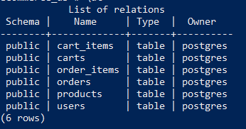

## Database
- Connect to PostgreSQL
  ```
  psql -U your_username -d postgres
  ```
- Create Database
  ```
  CREATE DATABASE ecommerce_db;
  ```
- Connect to the New Database
  ```
  \c ecommerce_db;
  ```
## Create Tables
  ```
-- Users Table
CREATE TABLE Users (
    user_id SERIAL PRIMARY KEY,
    username VARCHAR(255) NOT NULL,
    password VARCHAR(255) NOT NULL,
    first_name VARCHAR(255) NOT NULL,
    last_name VARCHAR(255) NOT NULL,
    email VARCHAR(255) NOT NULL
);

-- Products Table
CREATE TABLE Products (
    product_id SERIAL PRIMARY KEY,
    name VARCHAR(255) NOT NULL,
    price DECIMAL(10, 2) NOT NULL,
    description VARCHAR(255)
);

-- Carts Table
CREATE TABLE Carts (
    cart_id SERIAL PRIMARY KEY,
    user_id INTEGER REFERENCES Users(user_id),
    created_at TIMESTAMP DEFAULT CURRENT_TIMESTAMP
);

-- Cart_Items Table
CREATE TABLE Cart_Items (
    cart_item_id SERIAL PRIMARY KEY,
    cart_id INTEGER REFERENCES Carts(cart_id),
    product_id INTEGER REFERENCES Products(product_id),
    quantity INTEGER
);

-- Orders Table
CREATE TABLE Orders (
    order_id SERIAL PRIMARY KEY,
    user_id INTEGER REFERENCES Users(user_id),
    status VARCHAR(255),
    created_at TIMESTAMP DEFAULT CURRENT_TIMESTAMP,
    total_price DECIMAL(10, 2)
);

-- Order_Items Table
CREATE TABLE Order_Items (
    order_item_id SERIAL PRIMARY KEY,
    order_id INTEGER REFERENCES Orders(order_id),
    product_id INTEGER REFERENCES Products(product_id),
    quantity INTEGER,
    price DECIMAL(10, 2)
);  
  ```


<div align="center">
  
</div>
